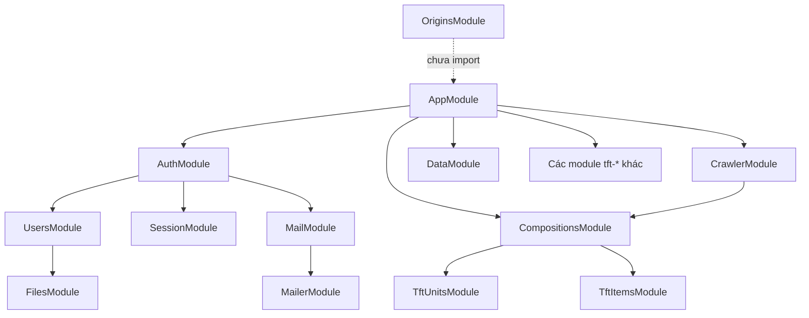

# BetFT Backend Module Handbook

Tài liệu này mô tả kiến trúc hiện tại theo từng NestJS module, được đối chiếu với `AppModule`, controller, service, DTO, domain và persistence.

## Quy ước chung

- API dùng global prefix từ `APP_API_PREFIX` và URI version `v1`.
- Database là MongoDB qua Mongoose.
- Resource có persistence đi theo luồng `Controller -> Service -> Repository abstraction -> Document repository -> Schema`.
- Swagger ở `/docs`; route `/` và `/images` được loại khỏi global prefix.
- Dataset TFT tĩnh và các collection Mongo `tft-*` là hai luồng độc lập.



## AppModule

**Source:** `src/app.module.ts`

Module gốc khởi tạo config, MongoDB, cache toàn cục, scheduler và các module nghiệp vụ. Cache có TTL `0`, giữ đến khi server restart.

Các module được mount: Users, Files, Auth, Session, Mail, Mailer, Home, Compositions, Crawler, toàn bộ resource `tft-*`, Data, ScreenTracking, Feedback và Images.

`OriginsModule` có source đầy đủ nhưng chưa được import nên route origins chưa hoạt động.

## AuthModule

**Source:** `src/auth/`

Đăng ký/đăng nhập email, confirm email, reset password, access/refresh token, logout và profile hiện tại. Phụ thuộc Users, Session, Mail, Passport và JWT. Refresh token được kiểm soát bằng session lưu trong Mongo.

| Method | Route | Chức năng |
|---|---|---|
| POST | `/v1/auth/email/login` | Đăng nhập |
| POST | `/v1/auth/email/register` | Đăng ký |
| POST | `/v1/auth/email/confirm` | Confirm email |
| POST | `/v1/auth/email/confirm/new` | Gửi lại confirm |
| POST | `/v1/auth/forgot/password` | Yêu cầu reset |
| POST | `/v1/auth/reset/password` | Đặt password mới |
| GET | `/v1/auth/me` | User hiện tại |
| POST | `/v1/auth/refresh` | Refresh token |
| POST | `/v1/auth/logout` | Xóa session |
| PATCH | `/v1/auth/me` | Cập nhật profile |
| DELETE | `/v1/auth/me` | Xóa tài khoản |

## UsersModule

**Source:** `src/users/`

CRUD user cho admin và cung cấp `UsersService` cho Auth. Phụ thuộc Files và document persistence. Model chứa email, password hash, provider/social ID, profile, role, status, photo và token confirm/reset.

| Method | Route | Ghi chú |
|---|---|---|
| POST | `/v1/users` | Admin tạo user |
| GET | `/v1/users` | Filter/sort/pagination |
| GET | `/v1/users/:id` | Chi tiết |
| PATCH | `/v1/users/:id` | Cập nhật |
| DELETE | `/v1/users/:id` | Xóa |

Toàn controller dùng `@Roles(RoleEnum.admin)`.

## SessionModule

**Source:** `src/session/`

Module nội bộ, không có controller. Tạo/tìm/xóa refresh session và xóa toàn bộ session của user. Session liên kết user và lưu hash dùng để xác minh refresh token.

## FilesModule

**Source:** `src/files/`

Lưu metadata file và chọn uploader theo `FILE_DRIVER`.

| Driver | Module | Hành vi |
|---|---|---|
| local | `FilesLocalModule` | Multipart lưu local |
| s3 | `FilesS3Module` | Backend upload S3 |
| s3-presigned | `FilesS3PresignedModule` | Client upload qua presigned URL |

Controller upload nằm trong từng infrastructure uploader. Service/repository được export cho Users và Origins.

## MailModule

**Source:** `src/mail/`

Xây dựng email activation, reset password và confirm email mới bằng template Handlebars trong `mail-templates`. Được Auth gọi và phụ thuộc `MailerModule`.

## MailerModule

**Source:** `src/mailer/`

Adapter transport gửi mail cấp thấp. Nghiệp vụ nên gọi `MailService`; `MailerService` chỉ xử lý transport.

## HomeModule

**Source:** `src/home/`

`GET /` trả health/welcome response cơ bản. Route này không dùng API prefix.

## DataModule

**Source:** `src/data/`

Phục vụ dataset TFT tĩnh cho FE theo mùa và locale. File dùng quy ước:

```text
TFTSet{season_id}_latest_{locale}.json
```

`season_id` nhận `16` hoặc `set16`, mặc định `16`. Locale phải có dạng `xx_xx`.

| Route GET | Dữ liệu |
|---|---|
| `/v1/data/tft/:locale?season_id=16` | Toàn bộ dataset |
| `/v1/data/tft-set16/:locale?season_id=16` | Alias cũ |
| `/v1/data/tft-set16/locales?season_id=16` | Locale có sẵn |
| `/v1/data/units/:locale?season_id=16` | Units |
| `/v1/data/items/:locale?season_id=16` | Items |
| `/v1/data/augments/:locale?season_id=16` | Augments |
| `/v1/data/traits/:locale?season_id=16` | Traits |
| `/v1/data/armory-items/:locale?season_id=16` | Armory items |
| `/v1/data/augment-odds/:locale?season_id=16` | Augment odds |
| `/v1/data/roles/:locale?season_id=16` | Roles |
| `/v1/data/portals/:locale?season_id=16` | Portals |
| `/v1/data/encounters/:locale?season_id=16` | Encounters |
| `/v1/data/augment-categories/:locale?season_id=16` | Categories |
| `/v1/data/extra-translations/:locale?season_id=16` | Extra translations |
| `/v1/data/zaps/:locale?season_id=16` | Zaps |
| `/v1/data/file/:filename` | File JSON theo tên |

Response cache public một giờ. File không tồn tại trả `404`; route file chặn path traversal. `nest-cli.json` copy `asset/**/*.json` sang build.

## CompositionsModule

**Source:** `src/compositions/`

CRUD, search/filter, search theo units và parse HTML Mobalytics thành composition. Mỗi document có `season_id`; FE có thể truyền `season_id` trong filter để chỉ lấy đội hình của một mùa. Phụ thuộc TftItems, TftUnits và Mongo persistence.

| Method | Route | Chức năng |
|---|---|---|
| POST | `/v1/compositions` | Tạo |
| POST | `/v1/compositions/search-v2` | Advanced search |
| GET | `/v1/compositions` | Danh sách phân trang |
| GET | `/v1/compositions/:id` | Theo Mongo ID |
| GET | `/v1/compositions/compId/:compId` | Theo business ID |
| PATCH | `/v1/compositions/:id` | Cập nhật |
| DELETE | `/v1/compositions/:id` | Xóa |
| POST | `/v1/compositions/search-by-units` | Search unit |
| POST | `/v1/compositions/parse-mobalytics-html` | Parse HTML |

Filter: `name`, `compId`, `difficulty`, `tier`, `isLateGame`, `isOp`, `active`, `units`, `searchInAllArrays`.

Model gồm metadata, board size, units cuối trận, early/mid/bench, carry items, augments, core champion, carousel priority, notes, teamcode và order. `compId` unique toàn collection. Module chưa có season field.

## CrawlerModule

**Source:** `src/crawler/`

Crawl Mobalytics, map item/unit và đồng bộ compositions. Phụ thuộc Compositions và TftUnits; selector HTML có rủi ro hỏng khi nguồn đổi layout.

| Method | Route | Chức năng |
|---|---|---|
| POST | `/v1/crawler/comp-detail` | Crawl một detail |
| POST | `/v1/crawler/team-comps` | Crawl danh sách |
| POST | `/v1/crawler/crawl-all` | Full crawl |
| POST | `/v1/crawler/units-tier` | Crawl/cập nhật tier |
| POST | `/v1/crawler/mobalytics-set` | Crawl toàn bộ public data theo `setKey` và lưu season snapshot |

Toàn bộ CrawlerController yêu cầu JWT của admin. Snapshot Mobalytics được lưu riêng theo `(season_id, locale)`; xem `mobalytics-set-crawler.md`.

## TftUnitsModule

**Source:** `src/tft-units/`

Quản lý champion: `apiName`, tên, cost, icons, role, tier, unlock, ability, stats, traits, popular items. `apiName` unique. Import: `src/asset/import-tft-units.ts`.

| Method | Route |
|---|---|
| POST | `/v1/tft-units` |
| GET | `/v1/tft-units` |
| GET | `/v1/tft-units/list-all` |
| GET | `/v1/tft-units/api-name/:apiName` |
| GET | `/v1/tft-units/cost/:cost` |
| GET | `/v1/tft-units/:id` |
| PATCH | `/v1/tft-units/:id` |
| DELETE | `/v1/tft-units/:id` |

## TftItemsModule

**Source:** `src/tft-items/`

Quản lý item: tên, mô tả, icon, traits, công thức ghép, effects, tags, unique/disabled, type, texture và tier. `apiName` unique. Import: `import-tft-items.ts`.

Routes CRUD: `POST/GET /v1/tft-items`, `GET/PATCH/DELETE /v1/tft-items/:id`, `GET /v1/tft-items/api-name/:apiName`.

## TftTraitsModule

**Source:** `src/tft-traits/`

Quản lý tộc/hệ: tên, mô tả, icon, effect breakpoints, units, unit properties và loại `origin/class`. `apiName` unique. Import: `import-tft-traits.ts`.

Routes CRUD: `POST/GET /v1/tft-traits`, `GET/PATCH/DELETE /v1/tft-traits/:id`, `GET /v1/tft-traits/api-name/:apiName`.

## TftAugmentsModule

**Source:** `src/tft-augments/`

Quản lý augment: tên, mô tả, icon, tier/stage, effects và variables. `apiName` unique. Import: `import-tft-augments.ts`.

Routes CRUD: `POST/GET /v1/tft-augments`, `GET/PATCH/DELETE /v1/tft-augments/:id`, `GET /api-name/:apiName`, `GET /stage/:stage`.

## TftArmoryItemsModule

**Source:** `src/tft-armory-items/`

Quản lý lựa chọn/item armory. Import: `import-tft-armory-items.ts`.

Routes CRUD: `POST/GET /v1/tft-armory-items`, `GET/PATCH/DELETE /:id`, `GET /api-name/:apiName`.

## TftAugmentOddsModule

**Source:** `src/tft-augment-odds/`

Quản lý bảng xác suất augment theo stage/round; danh sách không phân trang. Import: `import-tft-augment-odds.ts`.

Routes: `POST/GET /v1/tft-augment-odds`, `GET/PATCH/DELETE /v1/tft-augment-odds/:id`.

## TftRolesModule

**Source:** `src/tft-roles/`

Quản lý role champion và item gợi ý. `apiName` unique. Import: `import-tft-roles.ts`.

Routes: `POST/GET /v1/tft-roles`, `GET/PATCH/DELETE /:id`, `GET /api-name/:apiName`.

## FeedbackModule

**Source:** `src/feedback/`

`POST /v1/feedbacks` nhận feedback và metadata client, sau đó lưu Mongo. Hiện chưa có API admin đọc/xử lý feedback.

## ScreenTrackingModule

**Source:** `src/screen-tracking/`

`POST /v1/screen-trackings` ghi screen event cùng device ID, app version, location, language và OS. Tracking failure phía client không nên chặn luồng nghiệp vụ chính.

## ImagesModule

**Source:** `src/images/`

`GET /images/:type/:key.:ext` resolve/trả ảnh TFT, đặt content type/cache và xử lý missing image. Controller không version và `/images` được loại khỏi global prefix.

## OriginsModule

**Source:** `src/origin/`

CRUD origin/tộc-hệ, query champion theo origin và liên kết Files. Module **chưa import vào AppModule**, nên route chưa mount.

Routes dự kiến: CRUD `/v1/origins`, `GET /key/:key`, `GET /:id/champions`.

## Database và persistence modules

**Source:** `src/database/` và `*/infrastructure/persistence/document/`

Mỗi persistence module đăng ký schema, bind abstract repository với document repository, export repository và dùng mapper chuyển schema/domain. Seed admin/user nằm trong `src/database/seeds/document`.

`TftSeasonSnapshotsModule` lưu raw normalized snapshot từ nguồn ngoài. Module này dùng compound unique index `{ season_id, locale }` và được Data/Crawler cùng sử dụng.

## Roles và Statuses

**Source:** `src/roles/`, `src/statuses/`

Không phải module runtime độc lập. Roles cung cấp enum/decorator/guard; Statuses cung cấp trạng thái user.

## Admin web

**Repo:** `../admin-web`

Next.js App Router phục vụ login, dashboard và quản lý compositions. `lib/api.ts` tập trung API client; token lưu `localStorage`; `items-context.tsx` cache items. Builder lookup units, traits, items và augments từ các Mongo resource.

## Hai luồng dữ liệu TFT

| Luồng | Nguồn | Mục đích |
|---|---|---|
| Tĩnh theo mùa | `TFTSet{season}_latest_{locale}.json` qua DataModule | FE tải dataset |
| Mongo resource | Collections `tft-*` | Admin, crawler, lookup, builder |

DataModule và collection compositions đã hỗ trợ `season_id`. Các collection Mongo còn lại như units, items, traits và augments vẫn cần bổ sung field/index riêng nếu muốn import đồng thời nhiều mùa vào từng collection đó.

## Checklist thêm mùa

1. Thêm `TFTSet{season_id}_latest_{locale}.json` vào `src/asset`.
2. Kiểm tra các section FE sử dụng.
3. Test endpoint toàn bộ và endpoint section với `season_id`.
4. Cập nhật import scripts đang hard-code Set 16 nếu cần refresh Mongo.
5. Quyết định ghi đè hay giữ song song Mongo data; hiện `apiName` unique toàn collection.
6. Import/crawl compositions mới.
7. Test admin builder với data mới.
8. Build và kiểm tra file được copy sang `dist/asset`.

## Khoảng trống đã nhận diện

- Import scripts đang hard-code `TFTSet16_latest_en_us.json`.
- Các collection `tft-*` chưa có season field; compositions đã có `season_id`.
- `OriginsModule` chưa mount.
- Admin chưa có UI chọn mùa.
- Alias Data cũ còn tên `tft-set16`.
